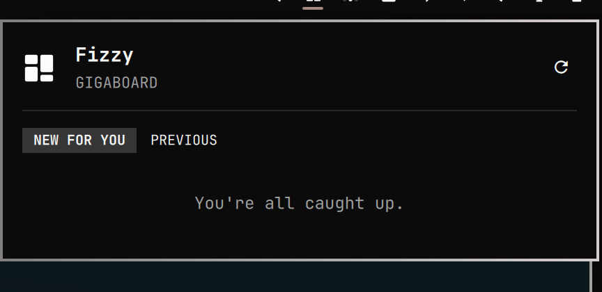

# Fizzy for Omarchy

Unread [Fizzy](https://fizzy.do) notifications in your [Omarchy](https://omarchy.org/) bar.

[](https://github.com/gigasolo/omarchy-fizzy/releases/tag/v1.0.0)
[](LICENSE)
[](https://omarchy.org/)

<p align="center">
  
</p>

Click the mark to open a keyboard-friendly tray, open a card in the browser, and mark it read. If the Fizzy CLI is not installed or you have not signed in yet, the panel shows how to finish setup.

This is **version 1.0.0**, the first stable release. It is an independent MIT-licensed plugin for Omarchy 4 (Quattro) and is not affiliated with or endorsed by 37signals.

## Install

A third-party Omarchy plugin is a git repo with `manifest.json` at the root. Add this one with:

```sh
omarchy plugin add https://github.com/gigasolo/omarchy-fizzy.git --enable
```

Omarchy may ask which side of the bar to use. The default is the right.

> [!IMPORTANT]
> Plugins run as unsandboxed code inside your long-lived `omarchy-shell` process. Only add repos you trust, and [read the source](https://github.com/gigasolo/omarchy-fizzy) before you enable one.

Without `--enable`, the plugin is cloned and left off so you can review it first:

```sh
omarchy plugin add https://github.com/gigasolo/omarchy-fizzy.git
less ~/.config/omarchy/plugins/lonbaker.fizzy/README.md
omarchy plugin enable lonbaker.fizzy --section right
```

## First-time setup

You do not need the Fizzy CLI set up before installing the plugin. Click the new mark. If setup is still needed, you will see a card like this:

<p align="center">
  
</p>

Click the card or press `s`. That uses the Omarchy-native path:

| What is missing | What the panel does |
| --- | --- |
| Fizzy CLI | Opens a terminal and runs `omarchy pkg aur add fizzy-cli`, then `fizzy setup` |
| Sign-in | Opens `fizzy setup` in a terminal |

When the terminal closes, refresh the panel (right-click the mark, or press `r`).

To do the same yourself:

```sh
omarchy pkg aur add fizzy-cli
fizzy setup
fizzy auth status
```

The plugin uses the CLI's current login only. Multiple Fizzy accounts are not supported. The plugin never reads your token.

## Use

| Action | How |
| --- | --- |
| Open or close the panel | Left-click the mark |
| Refresh now | Right-click or middle-click, or press `r` |
| Move | `j` / `k` or the arrow keys |
| Open the selected card | Enter |
| Install or sign in | Click the setup card, or press `s` |
| Unread / previous | `u` / `p` |
| Mark all read | `m` |
| Close | Escape |
| Next bar panel | Tab |

## Update and remove

```sh
omarchy plugin update lonbaker.fizzy
omarchy plugin remove lonbaker.fizzy
```

`omarchy plugin update` shows the diff and fast-forwards the git checkout. Removing the plugin does not log you out of Fizzy.

## Settings

Change these on the widget entry in `~/.config/omarchy/shell.json`, or with `omarchy bar`:

| Setting | Default | Meaning |
| --- | --- | --- |
| `refreshIntervalSec` | `300` | How often the bar polls Fizzy. Opening the panel also refreshes if the data is stale. |
| `maxItems` | `40` | Newest notifications kept after each refresh. |

## Privacy

The plugin only runs these local commands. It never sends a token on the command line, and it never writes notification content to disk.

```
fizzy identity show --json
fizzy notification list --json
fizzy notification read <id> --json
fizzy notification read-all --json
```

## If something is wrong

**The mark is missing.** Confirm the plugin is enabled:

```sh
omarchy plugin list | grep fizzy
omarchy plugin enable lonbaker.fizzy --section right
```

**The panel says the CLI is not installed.** Click **Install Fizzy CLI**, or run `omarchy pkg aur add fizzy-cli` yourself.

**The panel says to sign in.** Click **Set up Fizzy**, or run `fizzy setup` in a terminal, then refresh.

**The count looks stale.** Right-click to refresh, or wait for the next poll.

## Develop

```sh
git clone https://github.com/gigasolo/omarchy-fizzy.git
cd omarchy-fizzy
./tests/run
```

That runs the Model tests and `omarchy plugin validate .`, the same checks Omarchy uses before it will install a plugin.

To load a local checkout:

```sh
omarchy plugin add "$PWD" --enable
```

See [CONTRIBUTING.md](CONTRIBUTING.md).

## Sharing

Omarchy distributes third-party plugins as public git repos. Anyone can run `omarchy plugin add` against this URL.

To help people find it, list it at [omarchyplugins.com](https://omarchyplugins.com).

## License

[MIT](LICENSE). Copyright (c) 2026 Lon Baker.

SPDX-License-Identifier: MIT

Fizzy and Omarchy are trademarks of their respective owners.
