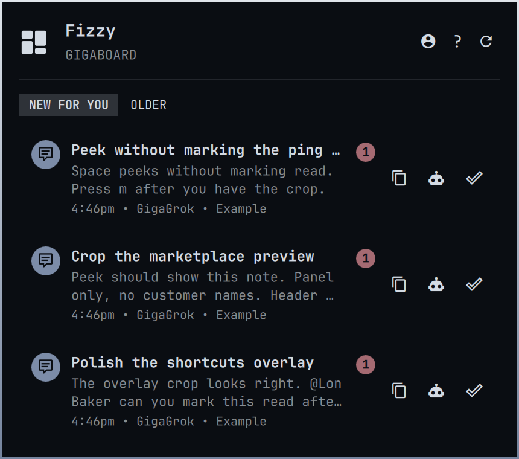
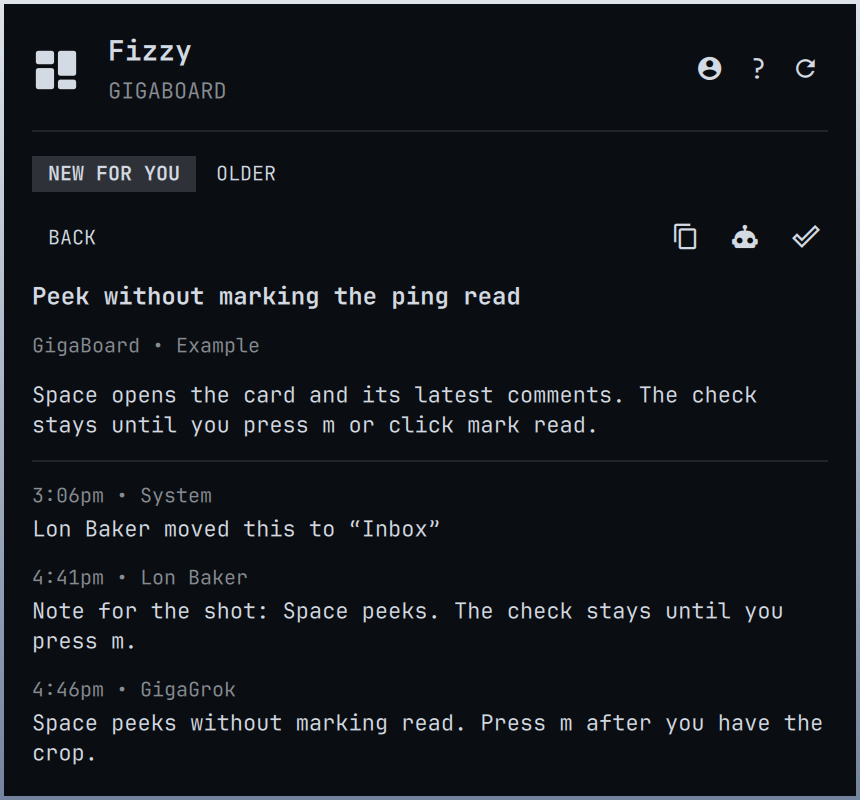
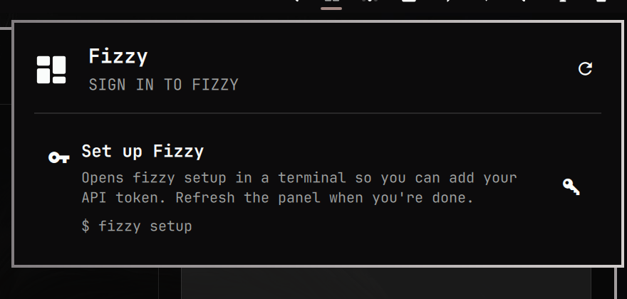
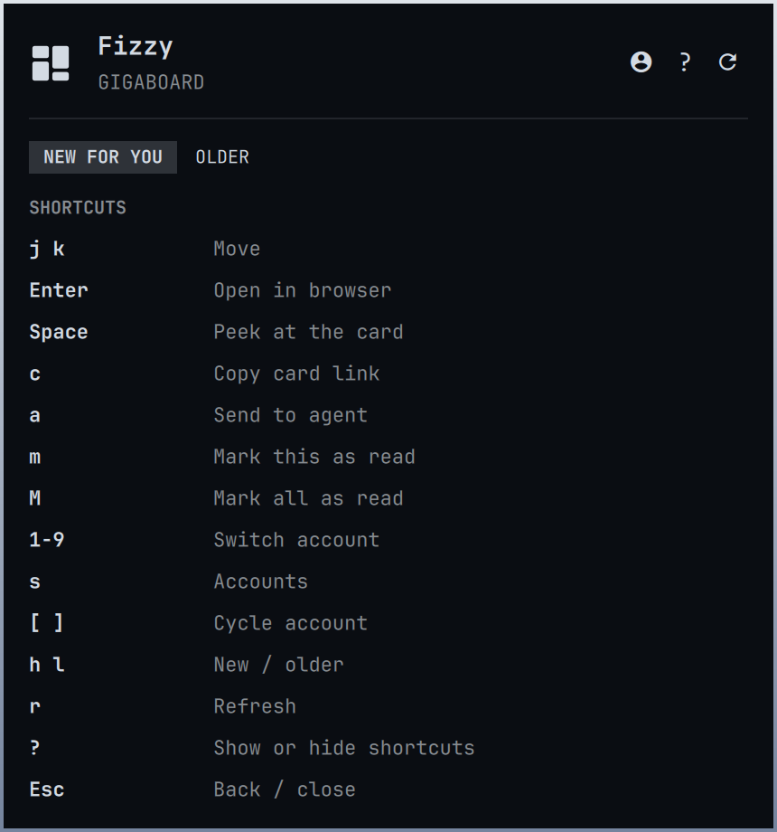
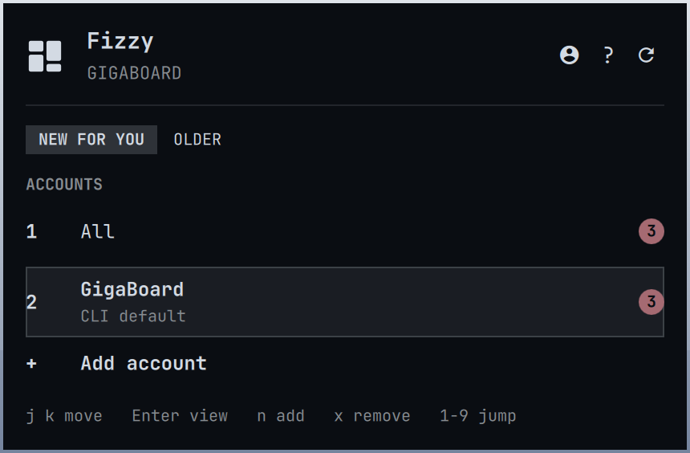

# Fizzy for Omarchy

Unread [Fizzy](https://fizzy.do) notifications in your [Omarchy](https://omarchy.org/) bar.

[](https://github.com/gigasolo/omarchy-fizzy/releases)
[](LICENSE)
[](https://omarchy.org/)

<p align="center">
  
  
</p>

Click the mark to open a keyboard-friendly tray. **New for you** is your Fizzy inbox (assigned, mentioned, or activity you watch) — not every new card on the board. **Older** is pings you have already seen. Every signed-in CLI profile is combined. Press `s` (or the accounts button) for the workspace-style switcher: `1` is All, `2`–`9` jump to an account. Add and remove logins from that overlay. Peek at a card and its comments, copy or open the link, send it to your Omarchy agent (Send to Agent), or mark a new ping read. Press `?` for shortcuts. If the Fizzy CLI is not installed or you have not signed in yet, the panel shows how to finish setup.

This is an independent MIT-licensed plugin for Omarchy 4 (Quattro). It is not affiliated with or endorsed by 37signals.

See [CHANGELOG.md](CHANGELOG.md) for what shipped in 1.1.0 and what is still unreleased. Hero and marketplace shots are from the GigaBoard Example board — [docs/screenshots.md](docs/screenshots.md).

## Install

A third-party Omarchy plugin is a git repo with `manifest.json` at the root. Add this one with:

```sh
omarchy plugin add https://github.com/gigasolo/omarchy-fizzy.git --enable
```

Omarchy may ask which side of the bar to use. The default is the right.

> [!IMPORTANT]
> Plugins run as unsandboxed code inside your long-lived `omarchy-shell` process. Only add repos you trust, and [read the source](https://github.com/gigasolo/omarchy-fizzy) before you enable one.

Without `--enable`, the plugin is cloned and left off so you can review it first:

```sh
omarchy plugin add https://github.com/gigasolo/omarchy-fizzy.git
less ~/.config/omarchy/plugins/gigasolo.fizzy/README.md
omarchy plugin enable gigasolo.fizzy --section right
```

## First-time setup

You do not need the Fizzy CLI set up before installing the plugin. Click the new mark. If setup is still needed, you will see a card like this:

<p align="center">
  
</p>

Click the card or press `s`. That uses the Omarchy-native path:

| What is missing | What the panel does |
| --- | --- |
| Fizzy CLI | Opens a terminal and runs `omarchy pkg aur add fizzy-cli`, then `fizzy setup` |
| Sign-in | Opens `fizzy setup` in a terminal |

When the terminal closes, refresh the panel (right-click the mark, or press `r`).

To do the same yourself:

```sh
omarchy pkg aur add fizzy-cli
fizzy setup
fizzy auth status
```

The plugin discovers every signed-in Fizzy CLI profile (`fizzy auth list`) and shows a combined inbox. Press `s` for the accounts overlay (`1` All, `2`–`9` jump). Add opens `fizzy setup --profile` in a terminal. Remove signs that profile out. The plugin never reads your token and never runs `fizzy auth switch`.

## Use

Click **New for you** / **Older**, or use `h` / `l` and the left / right arrows. `u` / `p` jump the same way.

Each unread row has copy, send-to-agent, and mark-read buttons. Clicking the row (or pressing Enter) opens the card in the browser and marks the ping read. Space peeks without marking it read. `m` marks this ping read on New for you only.

| Action | How |
| --- | --- |
| Open or close the panel | Left-click the mark |
| Refresh now | Right-click or middle-click, or press `r` |
| Move | `j` / `k` or the up / down arrows |
| New / older | Click the tabs, `h` / `l`, the left / right arrows, or `u` / `p` |
| Switch account | `1` All, `2`–`9` a signed-in account (workspace-style) |
| Accounts overlay | `s`, or the accounts button. `n` add, `x` remove, `j` / `k` move |
| Cycle account | `[` / `]` |
| Open the selected card in the browser | Click the row, or press Enter |
| Peek at the card and comments | Space |
| Copy card link | Row button, peek button, or `c` |
| Send the card to your Omarchy agent | Row button, peek button, or `a` |
| Mark this as read | Row or peek check, or `m` (New for you) |
| Mark all as read | `M` |
| Shortcuts | `?` or the help button |
| Install or sign in | Click the setup card, or press `s` |
| Close | Escape |
| Next bar panel | Tab |

<p align="center">
  
  
</p>

## Update and remove

```sh
omarchy plugin update gigasolo.fizzy
omarchy plugin remove gigasolo.fizzy
```

`omarchy plugin update` shows the diff and fast-forwards the git checkout. Removing the plugin does not log you out of Fizzy.

If you installed an early 1.0 copy as `lonbaker.fizzy`, `omarchy plugin update` cannot rename it. Remove that checkout, then add this repo again.

## Settings

Change these on the widget entry in `~/.config/omarchy/shell.json`, or with `omarchy bar`:

| Setting | Default | Meaning |
| --- | --- | --- |
| `refreshIntervalSec` | `300` | How often the bar polls Fizzy. Opening the panel also refreshes if the data is stale. |
| `maxItems` | `40` | Newest notifications kept after each refresh. |

## Privacy

The plugin only runs these local commands. It never sends a token on the command line, and it never writes notification content to disk. Copy uses `wl-copy -- <url>` (no shell). Send-to-agent passes a capped prompt to `omarchy-agent-prompt`. Card links must be `https` on `*.fizzy.do`.

```
fizzy auth list --json
fizzy --profile <name> identity show --json
fizzy --profile <name> notification list --limit <maxItems> --json
fizzy --profile <name> notification read <id> --json
fizzy --profile <name> notification read-all --json
fizzy --profile <name> card show <number> --json
fizzy --profile <name> comment list --card <number> --limit 8 --json
```

## If something is wrong

**The mark is missing.** Confirm the plugin is enabled:

```sh
omarchy plugin list | grep fizzy
omarchy plugin enable gigasolo.fizzy --section right
```

**The panel says the CLI is not installed.** Click **Install Fizzy CLI**, or run `omarchy pkg aur add fizzy-cli` yourself.

**The panel says to sign in.** Click **Set up Fizzy**, or run `fizzy setup` in a terminal, then refresh.

**The count looks stale.** Right-click to refresh, or wait for the next poll.

## Develop

```sh
git clone https://github.com/gigasolo/omarchy-fizzy.git
cd omarchy-fizzy
./tests/run
```

That runs the Model tests, `tests/qml.test.sh` (QML grep invariants), and `omarchy plugin validate .`, the same checks Omarchy uses before it will install a plugin.

To load a local checkout:

```sh
omarchy plugin add "$PWD" --enable
```

See [CONTRIBUTING.md](CONTRIBUTING.md).

## Sharing

Omarchy distributes third-party plugins as public git repos. Anyone can run `omarchy plugin add` against this URL.

To help people find it, list it at [plugins.omarchy.org](https://plugins.omarchy.org/) (`omarchyplugins.com` redirects there). The marketplace preview is `preview.png`. Paste-ready listing copy lives in [docs/marketplace.md](docs/marketplace.md).

Published images must come from fake data on the GigaBoard **Example** board (`fizzy` profile `gigasolo`), never from VirtualPBX or another live board. How to seed that board, ping it from a second user, and crop the shots: [docs/screenshots.md](docs/screenshots.md).

## License

[MIT](LICENSE). Copyright (c) 2026 GigaSolo LLC.

SPDX-License-Identifier: MIT

Fizzy and Omarchy are trademarks of their respective owners.
